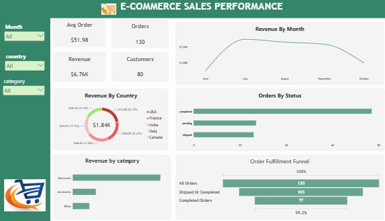
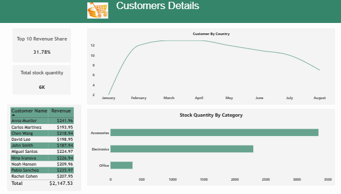

# E-commerce Sales Analysis

## Introduction
E-commerce businesses generate continuous streams of order, customer, and product data. Understanding this data helps businesses track performance, identify their most valuable customers, and manage stock effectively. This project analyzes an e-commerce sales dataset to uncover patterns in revenue, order fulfillment, customer value, and stock levels, presented through an interactive Power BI dashboard.

## Problem Statement
Without a clear view of sales and fulfillment performance, e-commerce businesses can struggle to identify where revenue is coming from, how reliably orders are being completed, and which customers and products matter most. This project explores the dataset to answer these questions and support better operational and customer-focused decisions.

## Data Sourcing
The dataset is an e-commerce sales and customer transactions dataset.

**Key Fields:**
- Order date / month
- Country
- Product category
- Order status
- Order amount
- Customer name and revenue
- Stock quantity by category

## Data Transformation & Cleaning
- Used SQL to clean and prepare the raw sales and customer data before analysis
- Identified and corrected missing or inconsistent values across order, customer, and product fields
- Standardized category, country, and order status labels

## Analytics and Measures
Built DAX measures and visuals in Power BI, covering:
- Average order value, total orders, total revenue, and total customers
- Top 10 customer revenue share
- Revenue by month, by country, and by category
- Orders by status
- Order fulfillment rate
- Total stock quantity and stock by category
- Customers by signup month

## Dashboard & Visuals
Designed a two-page interactive Power BI report, including:
- KPI cards: Average Order, Orders, Revenue, Customers, Top 10 Revenue Share, Total Stock Quantity
- Revenue by Month
- Revenue by Country
- Orders by Status
- Order Fulfillment Funnel (All Orders → Shipped/Completed → Completed Orders)
- Customer by Country
- Stock Quantity by Category
- Customer Name by Revenue

## Insight and Findings
- The business generated $6.76K in revenue from 130 orders across 80 customers, with an average order value of $51.98.
- Revenue was spread across several countries, with the USA, France, and Italy among the leading markets.
- Of all orders placed, 59.2% were fully completed, meaning roughly 4 in 10 orders were still pending, shipped, or otherwise unresolved — a potential area for operational improvement.
- The top 10 customers accounted for 31.78% of total revenue, highlighting a strong reliance on a small group of high-value customers rather than a broad, evenly distributed customer base.
- Accessories held the highest stock quantity of all categories (roughly 3,500 units), followed by Electronics (around 2,300 units), with Office supplies holding the smallest stock.
- Customer sign-ups grew steadily through the earlier months before leveling off, suggesting acquisition efforts may need renewed focus in later periods.

## Recommendations
- Investigate the gap between shipped and completed orders to improve the order fulfillment rate.
- Develop loyalty or retention strategies for the top 10 customers, given their outsized share of revenue.
- Monitor stock levels for high-demand categories like Accessories and Electronics to avoid stockouts.

## Conclusion
This analysis demonstrates how e-commerce transaction data can be used to track sales performance, understand customer value concentration, and monitor fulfillment and stock levels, supporting more informed business decisions.
